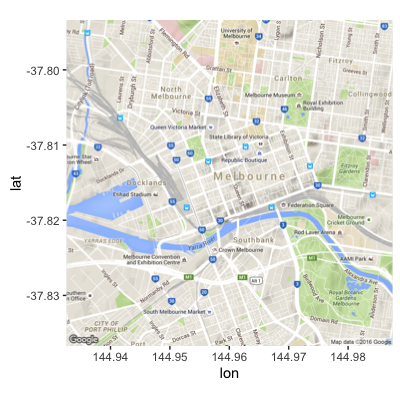
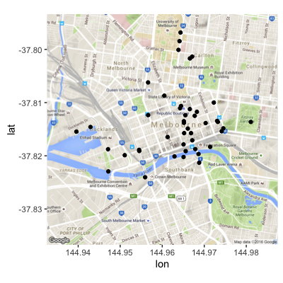

```{r setup, include = FALSE}
library("knitr")
opts_chunk$set(
  message = FALSE,
  warning = FALSE,
  error = FALSE,
  cache = FALSE,
  fig.height = 2,
  fig.width = 5,
  fig.caption = FALSE,
  collapse = TRUE,
  comment = "#>"
)
options(digits=2)
library("rmarkdown")
library("devtools")
library("readr")
library("tidyr")
library("ggplot2")
library("ggthemes")
library("gridExtra")
library("dplyr")
library("lubridate")
library("GGally")
library("rworldmap")
library("ggmap")
library("scales")
library("dichromat")
library("RColorBrewer")
library("viridis")
library("purrr")
library("broom")
library("timeDate")
library("haven")
library("boot")
library("plotly")
```

## Outline

- Session 1: How to think about data, and getting started plotting with the grammar of graphics
- Session 2: Wrangling data into shape, useful practices, cognitive perception
- <font color="#7c8a1a"> Session 3: Advanced graphics, layering, using maps</font>

## Building charts piecewise {.flexbox .vcenter #myImagePage1}


## Education 

Read the OECD PISA data

```{r load_data}
student <- readRDS("../data/student_sub.rds")
dim(student)
student$ST04Q01 <- factor(student$ST04Q01, 
  levels=c(1,2), labels=c("Female", "Male"))
```

## 

Calculate the statistics: Mean difference

```{r computemean}
student.stats <- student %>% 
  group_by(CNT) %>%
  summarise(wmathgap=weighted.mean(PV1MATH[ST04Q01=="Male"], 
                  w=SENWGT_STU[ST04Q01=="Male"], na.rm=T)-
               weighted.mean(PV1MATH[ST04Q01=="Female"],
                  w=SENWGT_STU[ST04Q01=="Female"], na.rm=T))
kable(head(student.stats))
```

## Map

- Means are point estimates
- Map mean difference to point geom, using position along a line

## Plot - Need to Order!

```{r fig.width=4, fig.height=4.5}
ggplot(data=student.stats) + 
  geom_point(aes(x=CNT, y=wmathgap), size=3) + 
 coord_flip() + theme_bw()
```

## Arrange

- Arrange: by country
- Order by magnitude of difference


##

```{r fig.width=4, fig.height=4.5}
student.stats$CNT <- factor(student.stats$CNT, 
    levels=student.stats$CNT[order(student.stats$wmathgap)])
ggplot(data=student.stats) + 
  geom_point(aes(x=CNT, y=wmathgap), size=3) + 
 coord_flip() + theme_bw()
```


## Inference

Create bootstrap confidence intervals for each mean difference

```{r}
cifn <- function(d, i) {
  x <- d[i,]
  ci <- weighted.mean(x$PV1MATH[x$ST04Q01=="Male"], 
          w=x$SENWGT_STU[x$ST04Q01=="Male"], na.rm=T)-
        weighted.mean(x$PV1MATH[x$ST04Q01=="Female"],
          w=x$SENWGT_STU[x$ST04Q01=="Female"], na.rm=T)
  ci
}
```

##
```{r}
bootfn <- function(d) {
  r <- boot(d, statistic=cifn, R=100)
  l <- sort(r$t)[5]
  u <- sort(r$t)[95]
  ci <- c(l, u)
  return(ci)
}
```

## 

Apply ci functions to data

```{r}
student.summary.gap.boot <- student %>% 
  split(.$CNT) %>% purrr::map(bootfn) %>% data.frame() %>%
  gather(CNT, value)
student.summary.gap.boot$ci <- 
  rep(c("ml","mu"), 
      length(unique(student.summary.gap.boot$CNT)))
student.summary.gap.boot.wide <- 
  student.summary.gap.boot %>% 
  spread(ci, value)
student.summary.gap <- merge(student.stats,
  student.summary.gap.boot.wide)
kable(head(student.summary.gap))
```

## Plot

```{r fig.width=4, fig.height=4.5}
ggplot(data=student.summary.gap) + 
  geom_point(aes(x=CNT, y=wmathgap), size=3) + 
  geom_segment(aes(x=CNT, xend=CNT, y=ml, yend=mu)) + 
  coord_flip() + theme_bw() 
```

## Enhance

Match three digit codes to country names, more recognizable labels

```{r}
student.summary.gap$name <- NA
for (i in 1:length(student.summary.gap$name))  
  student.summary.gap$name[i] <-
  isoToName(as.character(student.summary.gap$CNT[i]))
# QCN is Shanghai, not whole of China - 
# Don't know what country TAP is
student.summary.gap$name[
  student.summary.gap$CNT == "QCN"] <- 
  isoToName("CHN")
student.summary.gap$name[
  student.summary.gap$CNT == "TAP"] <- 
  "TAP"
```

## 

Create categorical gap variable to draw attention to significant difference

```{r}
student.summary.gap$wmathgap_cat <- "same"
student.summary.gap$wmathgap_cat[
  student.summary.gap$ml > 0] <- "boys"
student.summary.gap$wmathgap_cat[
  student.summary.gap$mu < 0] <- "girls"
kable(head(student.summary.gap))
```

## Order Again

```{r}
student.summary.gap$name <- factor(student.summary.gap$name, 
    levels=student.summary.gap$name[
      order(student.summary.gap$wmathgap)])
kable(head(student.summary.gap))
```

## Plot - with Guide Lines

```{r fig.show='hide'}
ggplot(data=student.summary.gap) + 
  geom_hline(yintercept=0, colour="grey80") + 
  geom_point(aes(x=name, y=wmathgap, color=wmathgap_cat), 
             size=3) + 
  geom_segment(aes(x=name, xend=name, y=ml, yend=mu, 
                   color=wmathgap_cat)) + 
  coord_flip() + theme_bw() 
```

##

```{r echo=FALSE, fig.width=6, fig.height=6}
ggplot(data=student.summary.gap) + 
  geom_hline(yintercept=0, colour="grey80") + 
  geom_point(aes(x=name, y=wmathgap, color=wmathgap_cat), 
             size=3) + 
  geom_segment(aes(x=name, xend=name, y=ml, yend=mu, 
                   color=wmathgap_cat)) + 
  coord_flip() + theme_bw()  
```

## Enhance More

- Labels
- Axis limits
- Grid lines
- Color

##

```{r fig.show='hide'}
ggplot(data=student.summary.gap) + 
  geom_hline(yintercept=0, colour="grey80") + 
  geom_point(aes(x=name, y=wmathgap, color=wmathgap_cat), size=3) + 
  geom_segment(aes(x=name, xend=name, y=ml, yend=mu, 
     color=wmathgap_cat)) + xlab("") +  
  scale_colour_manual("", values=c("boys"="skyblue", 
    "girls"="pink", "same"="lightgreen")) +
  scale_y_continuous("Girls <----------> Boys", 
    breaks=seq(-30, 30, 10), limits=c(-35, 35), 
    labels=c(seq(30, 0, -10), seq(10, 30, 10))) + 
  coord_flip() + theme_bw() + 
  theme(axis.text.x = element_text(size=5), 
        axis.text.y = element_text(size=5), 
        axis.title = element_text(size=7), 
        legend.text = element_text(size=5),
        legend.title = element_text(size=5))
```

##

```{r echo=FALSE, fig.width=6, fig.height=6}
ggplot(data=student.summary.gap) + 
  geom_hline(yintercept=0, colour="grey80") + 
  geom_point(aes(x=name, y=wmathgap, color=wmathgap_cat), 
             size=3) + 
  geom_segment(aes(x=name, xend=name, y=ml, yend=mu, 
                   color=wmathgap_cat)) + 
  xlab("") +  
  scale_colour_manual("", values=c("boys"="skyblue", 
    "girls"="pink", "same"="lightgreen")) +
  scale_y_continuous("Girls <----------> Boys", 
    breaks=seq(-30, 30, 10), limits=c(-35, 35), 
    labels=c(seq(30, 0, -10), seq(10, 30, 10))) + 
  coord_flip() + theme_bw() + 
  theme(axis.text.x = element_text(size=5), 
        axis.text.y = element_text(size=5), 
        axis.title = element_text(size=7), 
        legend.text = element_text(size=5),
        legend.title = element_text(size=5))
```

## Interactive

```{r fig.width=5, fig.height=5, fig.align='center', eval=FALSE}
ggplotly()
```

## Maps

Map data is essentially a set of points, and line segments. You can get maps from various sources, and wrangle the files/data into an R object. This can be merged with data to provide spatial context to problems.

```{r mapdata}
world <- getMap(resolution = "low")
extractPolys <- function(p) {
  polys <- NULL
  for (i in 1:length(p)) {
    for (j in 1:length(p[[i]]@Polygons)) {
      x <- p[[i]]@Polygons[[j]]@coords
      polys$lon <- c(polys$lon, x[,1])
      polys$lat <- c(polys$lat, x[,2])
      polys$ID <- c(polys$ID, rep(p[[i]]@ID, nrow(x)))
      polys$region <- c(polys$region, 
        rep(paste(p[[i]]@ID, j, sep="_"), nrow(x)))
      polys$order <- c(polys$order, 1:nrow(x))
    }
  }
  return(data.frame(polys))
}
polys <- extractPolys(world@polygons)
```

## 

Here is what is looks like:

```{r}
kable(head(polys))
```

## A map is a set of points...

```{r eval=FALSE}
ggplot(data=filter(polys, region=="New Zealand_2"), 
       aes(x=lon, y=lat)) + 
  geom_point()
```

```{r fig.width=6, fig.height=4, fig.align='center', echo=FALSE}
ggplot(data=filter(polys, region=="New Zealand_2"), 
       aes(x=lon, y=lat)) + 
  geom_point()
```

## connected in the right order

```{r fig.width=6, fig.height=4, fig.align='center'}
ggplot(data=filter(polys, region=="New Zealand_2"), 
       aes(x=lon, y=lat, order=order)) + 
  geom_path()
```

## as a group

```{r fig.width=6, fig.height=4, fig.align='center'}
ggplot(data=filter(polys, 
                   region=="New Zealand_1" | region=="New Zealand_2"), 
       aes(x=lon, y=lat, group=region, order=order)) + 
  geom_path()
```

## 

Join education data with map polygons

```{r}
polys <- polys %>% rename(name = ID)
student.map <- left_join(
  student.summary.gap, polys)
student.map <- student.map %>% 
  arrange(region, order)
```

## Map theme

Make it look like a map, by tweaking the plot appearance

```{r}
theme_map <- theme_bw()
theme_map$line <- element_blank()
theme_map$strip.text <- element_blank()
theme_map$axis.text <- element_blank()
theme_map$plot.title <- element_blank()
theme_map$axis.title <- element_blank()
theme_map$panel.border <- element_rect(
  colour = "grey90", size=1, fill=NA)
```

## Plot - axes, colors, coord system

```{r fig.show='hide'}
ggplot(data=polys) + 
  geom_path(aes(x=lon, y=lat, group=region, order=order), 
            colour=I("grey90"), size=0.1) + 
  geom_polygon(data=student.map, aes(x=lon, y=lat, 
            group=region, order=order,  
            fill=wmathgap_cat)) +
  scale_fill_manual("Diff>5", values=c("boys"="skyblue", 
                                    "girls"="pink", 
                                    "same"="lightgreen")) + 
  scale_x_continuous(expand=c(0,0)) + 
  scale_y_continuous(expand=c(0,0)) +
  coord_equal() + theme_map 
```

##

```{r echo=FALSE, fig.width=8, fig.height=6, fig.align='center'}
ggplot(data=polys) + 
  geom_path(aes(x=lon, y=lat, group=region, order=order), 
            colour=I("grey90"), size=0.1) + 
  geom_polygon(data=student.map, aes(x=lon, y=lat, 
            group=region, order=order,  
            fill=wmathgap_cat)) +
  scale_fill_manual("Diff>5", values=c("boys"="skyblue", 
                                    "girls"="pink", 
                                    "same"="lightgreen")) + 
  scale_x_continuous(expand=c(0,0)) + 
  scale_y_continuous(expand=c(0,0)) +
  coord_equal() + theme_map 
```

## Interactive

```{r fig.width=8, fig.height=4.5, fig.align='center', eval=FALSE}
ggplotly()
```

## Raster maps

Image maps can also be pulled using the package `ggmap` to use as the background for data.

```{r eval=FALSE}
gm <- get_googlemap(center = c(lon=144.96, lat=-37.815), zoom=14)
ggmap(gm) 
```



##

```{r eval=FALSE}
sensor_loc <- read_csv("../data/Pedestrian_Sensor_Locations.csv")
ggmap(gm) + geom_point(data=sensor_loc, aes(x=Longitude, y=Latitude))
```




## Multiple Plots on a Sheet

Occasionally you would like to organize your plots in special ways. The `gridExtra` can be used to take individual plots and lay them out together. 

```{r echo=FALSE}
p1 <- ggplot(data=student.summary.gap) + 
  geom_hline(yintercept=0, colour="grey80") + 
  geom_point(aes(x=name, y=wmathgap, color=wmathgap_cat), 
             size=3) + 
  geom_segment(aes(x=name, xend=name, y=ml, yend=mu, 
                   color=wmathgap_cat)) + 
  xlab("") +  
  scale_colour_manual("", values=c("boys"="skyblue", 
    "girls"="pink", "same"="lightgreen")) +
  scale_y_continuous("Girls <----------> Boys", 
    breaks=seq(-30, 30, 10), limits=c(-35, 35), 
    labels=c(seq(30, 0, -10), seq(10, 30, 10))) + 
  coord_flip() + theme_bw() + 
  theme(axis.text.x = element_text(size=5), 
        axis.text.y = element_text(size=5), 
        axis.title = element_text(size=7), 
        legend.text = element_text(size=5),
        legend.title = element_text(size=5))

p2 <- ggplot(data=polys) + 
  geom_path(aes(x=lon, y=lat, group=region, order=order), 
            colour=I("grey90"), size=0.1) + 
  geom_polygon(data=student.map, aes(x=lon, y=lat, 
            group=region, order=order,  
            fill=wmathgap_cat)) +
  scale_fill_manual("Diff>5", values=c("boys"="skyblue", 
                                    "girls"="pink", 
                                    "same"="lightgreen")) + 
  scale_x_continuous(expand=c(0,0)) + 
  scale_y_continuous(expand=c(0,0)) +
  coord_equal() + theme_map 
```

##

```{r fig.width=8, fig.height=4}
grid.arrange(p1, p2)
```

## Data Competition

- Download the earthquake data from David Harte's monitoring site
- [ftp://ftp.gns.cri.nz/pub/davidh/sslib/src/ssNZ_3.0-134.tar.gz](ftp://ftp.gns.cri.nz/pub/davidh/sslib/src/ssNZ_3.0-134.tar.gz)
- Using the tools discussed in this workshop, make a couple of plots that tell a story
- Show them off to the group between 3:40-3:55pm
- Best person/team plots win a prize

## Credit

Notes prepared by Di Cook, building on joint workshops with Carson Sievert, Heike Hofmann, Eric Hare, Hadley Wickham.

   

<a rel="license" href="http://creativecommons.org/licenses/by-sa/4.0/"></a><br />This work is licensed under a <a rel="license" href="http://creativecommons.org/licenses/by-sa/4.0/">Creative Commons Attribution-ShareAlike 4.0 International License</a>.
